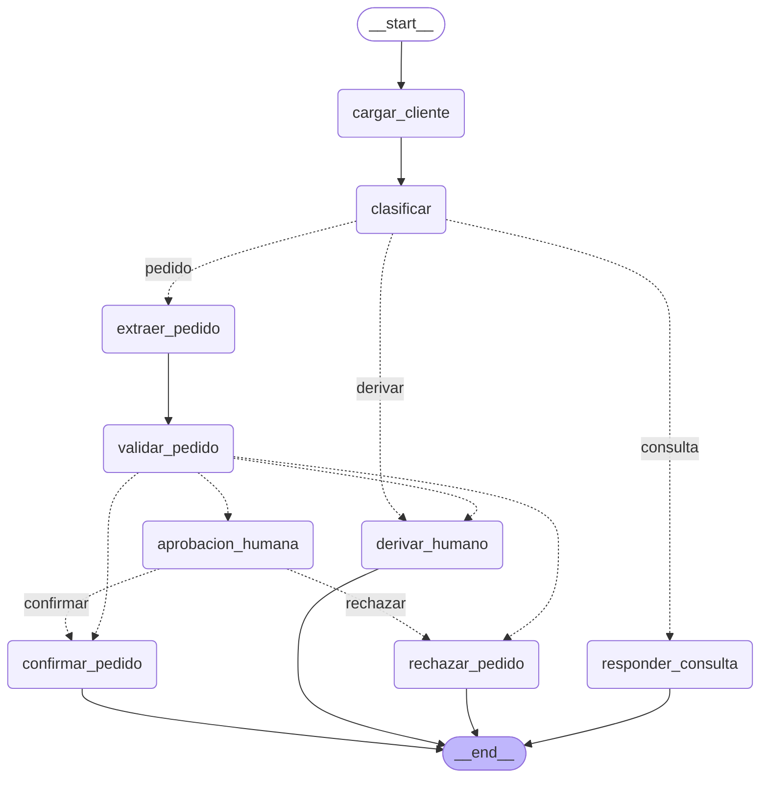

# 🗺️ Topología del Grafo de LangGraph

Este diagrama representa la máquina de estados de la Mesa de Pedidos (9 nodos, 3 routers y 5 hojas terminales).

```mermaid
graph TD
	__start__([__start__]):::first
	cargar_cliente(cargar_cliente)
	clasificar(clasificar)
	responder_consulta(responder_consulta)
	extraer_pedido(extraer_pedido)
	validar_pedido(validar_pedido)
	aprobacion_humana(aprobacion_humana)
	confirmar_pedido(confirmar_pedido)
	rechazar_pedido(rechazar_pedido)
	derivar_humano(derivar_humano)
	__end__([__end__]):::last
	__start__ --> cargar_cliente;
	aprobacion_humana -.->|confirmar| confirmar_pedido;
	aprobacion_humana -.->|rechazar| rechazar_pedido;
	cargar_cliente --> clasificar;
	clasificar -.->|derivar| derivar_humano;
	clasificar -.->|pedido| extraer_pedido;
	clasificar -.->|consulta| responder_consulta;
	extraer_pedido --> validar_pedido;
	validar_pedido -.-> aprobacion_humana;
	validar_pedido -.-> confirmar_pedido;
	validar_pedido -.-> derivar_humano;
	validar_pedido -.-> rechazar_pedido;
	confirmar_pedido --> __end__;
	derivar_humano --> __end__;
	rechazar_pedido --> __end__;
	responder_consulta --> __end__;
	classDef default fill:#f2f0ff,line-height:1.2
	classDef first fill-opacity:0
	classDef last fill:#bfb6fc
```
